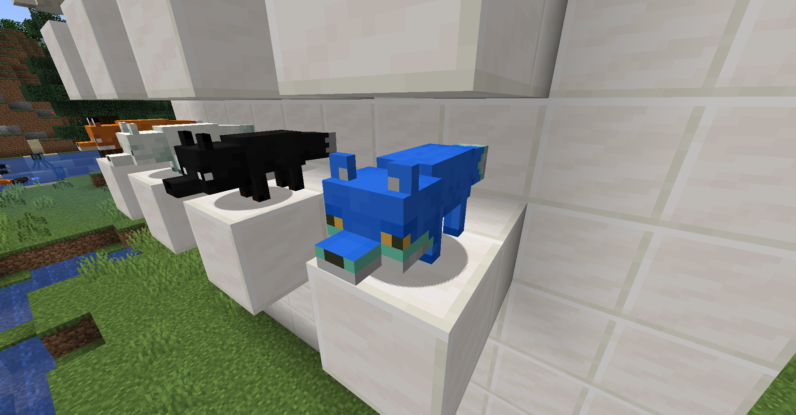

# Foxes

### In case it wasn't obvious, foxes _are_ players!

This simple mod adds more types of foxes to Minecraft.


The mod is available for both Forge and Fabric. **Make sure you download the correct version!**

#### Fabric requirements

- Requires Fabric Loader 0.11.6 or higher
- Works on any full Minecraft 1.17 release
- Fabric API is not required, but recommended anyway

#### Forge requirements

- Requires Minecraft Forge 37.0.0 or higher
- Works on any full Minecraft 1.17 release

## Fox types

This mod adds 6 new natural types, making a total of 8 natural types. In addition, it adds two skins for foxes with
certain name tags.

Foxes have a certain chance to have a specific type when spawned in a certain biome (this can be modified in a data
pack, see below).

### Red fox (vanilla)


The most common type of fox, spawning in all taiga variants except snowy ones.

- Type ID: `red`
- Summon: `/summon fox ~ ~ ~ {Type: red}`

### Arctic fox (vanilla)


The most common type of fox in snowy taiga biomes, highly dominating all other fox types there. Only spawns in snowy taiga biomes.

- Type ID: `snow`
- Summon: `/summon fox ~ ~ ~ {Type: snow}`

### Black fox


A relatively common type of fox that spawns in all taiga variants.

- Type ID: `black`
- Summon: `/summon fox ~ ~ ~ {Type: black}`

### Silver fox


A relatively common type of fox that spawns in all normal taiga variants. Has a rare chance to spawn in snowy taiga as well.

- Type ID: `silver`
- Summon: `/summon fox ~ ~ ~ {Type: silver}`

### Platinum fox


A rare type of fox that spawns in any taiga, yet more commonly in snowy biomes.

- Type ID: `platinum`
- Summon: `/summon fox ~ ~ ~ {Type: platinum}`

### Gold platinum fox


A rarer variant of the platinum fox, that spawns in any taiga, yet more commonly in snowy biomes.

- Type ID: `gold_platinum`
- Summon: `/summon fox ~ ~ ~ {Type: gold_platinum}`

### Grey fox


A relatively rare variant that spawns only in giant taiga biomes.

- Type ID: `grey`
- Summon: `/summon fox ~ ~ ~ {Type: grey}`

### Cross fox


A common variant that spawns in all not-snowy taiga biomes.

- Type ID: `cross`
- Summon: `/summon fox ~ ~ ~ {Type: cross}`

### Name tags

Naming a fox "FoxShadew" gives it this heterochromia skin:


Naming a fox "ZtereoHYPE" gives it this blue skin:



## Modifying spawn chances

It is possible to modify the chances of spawning foxes in biomes using a data pack.

Spawn chances are defined in a data pack using custom a `json` format. The files are located in `data/shwfox/shwfoxrates` and are named by the type ID's of foxes.

The JSON format looks like this (weights must be integers):
```json
{
  "biome_id": 300,
  "biome_id_2": 300,
  "<default>": 300
}
```

If a biome is not defined for any fox type, it falls back to `<default>`. If at least one fox type defines a biome specifically, the other fox types are considered to have zero weight and will not spawn in that biome.

If a file is not present in a data pack, it falls back to a file in another data pack, or the default data. It is recommended to specify a file for every type, and specify the same biomes in every file.

Note that the two special textures have no assigned type, and can hence not be defined in a spawn chance file.

**IMPORTANT NOTE: Defining spawn chances does NOT define in which biomes the types spawn _naturally_. It only defines the chance of getting that certain fox type when it is placed in that biome, either by natural spawning or a spawn egg. This is intentional, to modify which biomes have foxes, modify the biome JSON instead.**

Example (`cross.json`):
```json
{
  "taiga": 700,
  "taiga_hills": 700,
  "taiga_mountains": 700,

  "giant_tree_taiga": 1000,
  "giant_spruce_taiga": 1000,
  "giant_tree_taiga_hills": 1000,
  "giant_spruce_taiga_hills": 1000,

  "snowy_taiga": 0,
  "snowy_taiga_hills": 0,
  "snowy_taiga_mountains": 0,

  "<default>": 700
}
```

## Other changes

- This mod fixes [MC-170551](https://bugs.mojang.com/browse/MC-170551). Foxes can now properly spawn on podzol, dirt, or
  coarse dirt, making them much more common in giant tree taiga biomes.
- Spawning a fox using a spawn egg in snowy biomes other than snowy taigas now spawns arctic types (in vanilla it will
  incorrectly spawn red foxes), by default using the same rates as in snowy taigas.
- When the splash on the title screen reads `In case it wasn't obvious, foxes aren't players.`, it is replaced
  with `In case it wasn't obvious, foxes are players.`.

## Using in your development environment

You can download this mod in your development environment via my Maven repository.

### Fabric
```gradle
repositories {
    maven { url "https://maven.shadew.net/" }
}

dependencies {
    modImplementation ("net.shadew:foxes:1.1+fabric") {
        // Exclude Fabric API, presumably you already have this in your environment
        exclude group: "net.fabricmc"
        exclude group: "net.fabricmc.fabric-api"
    }
}
```

### Forge

```gradle
repositories {
    maven { url "https://maven.shadew.net/" }
}

dependencies {
    implementation fg.deobf("net.shadew:foxes:1.1+forge")
}
```
